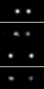

# Structured/Physically-Grounded Generative Networks

## Overview

- Hamiltonian Generative networks [@toth2019hamiltonian]
- Port-Hamiltonian Neural ODEs for Robot Dynamics

## HGN

- Input: images $\in \mathbb{R}^{3 \times h \times w}$
- Map to phase space $(p,q) \in \mathbb{R}^n$
- Learn the Hamiltonian $\mathcal{H}(p,q)$
  - Perhaps specifically as $\mathcal{H}(p,q) = T(p,q) + V(q)$
- Simulate forward by integrating $\mathcal{H}$ forward

## HGN

- Supervision is pixel decoding
- Energy-conserving, physically-grounded.
- [SHO results](http://localhost:6006/?darkMode=true#images&runSelectionState=eyJNYXIwNV8yMS00NS00OF9VSUNST2JvdGljc19zaG9fYmVuY2htYXJrIjpmYWxzZSwiTWFyMDVfMjItMDYtMjZfVUlDUk9ib3RpY3Nfc2hvX2ltYWdlcyI6ZmFsc2UsIk1hcjA1XzIyLTA4LTM5X1VJQ1JPYm90aWNzX3Nob19pbWFnZXMiOmZhbHNlLCJNYXIwNV8yMy0xMS0yM19VSUNST2JvdGljc19zaG9faW1hZ2VzIjpmYWxzZSwiTWFyMDVfMjMtMTMtMDJfVUlDUk9ib3RpY3Nfc2hvX2ltYWdlcyI6ZmFsc2UsIk1hcjA1XzIzLTE3LTQzX1VJQ1JPYm90aWNzX3Nob19pbWFnZXMiOmZhbHNlLCJNYXIwNV8yMy0zMi0zNV9VSUNST2JvdGljc19zaG9faW1hZ2VzIjpmYWxzZSwiTWFyMDVfMjMtMzUtMDFfVUlDUk9ib3RpY3Nfc2hvX2ltYWdlcyI6ZmFsc2UsIk1hcjA1XzIzLTM2LTU0X1VJQ1JPYm90aWNzX3Nob19pbWFnZXMiOmZhbHNlLCJNYXIwNV8yMy0zNy0yN19VSUNST2JvdGljc19zaG9faW1hZ2VzIjpmYWxzZSwiTWFyMDVfMjMtMzgtMDVfVUlDUk9ib3RpY3Nfc2hvX2ltYWdlcyI6ZmFsc2UsIk1hcjA1XzIzLTM5LTAyX1VJQ1JPYm90aWNzX3Nob19pbWFnZXMiOmZhbHNlLCJNYXIwNV8yMy00MC0xNV9VSUNST2JvdGljc19zaG9faW1hZ2VzIjpmYWxzZSwiTWFyMDVfMjMtNDctMzZfVUlDUk9ib3RpY3Nfc2hvX2ltYWdlcyI6ZmFsc2UsIk1hcjA1XzIzLTQ5LTE5X1VJQ1JPYm90aWNzX3Nob19pbWFnZXMiOmZhbHNlLCJNYXIwNV8yMy01NC01MV9VSUNST2JvdGljc19zaG9faW1hZ2VzIjpmYWxzZSwiTWFyMDVfMjMtNTUtNTZfVUlDUk9ib3RpY3Nfc2hvX2ltYWdlcyI6ZmFsc2UsIk1hcjA2XzAwLTA0LTQxX1VJQ1JPYm90aWNzX3Nob19pbWFnZXMiOmZhbHNlLCJNYXIwNl8wMC0wNy0yOF9VSUNST2JvdGljc19zaG9faW1hZ2VzIjpmYWxzZSwiTWFyMDZfMTMtMTMtMTVfVUlDUk9ib3RpY3Nfc2hvX2ltYWdlcyI6ZmFsc2UsIk1hcjA2XzEzLTE2LTExX1VJQ1JPYm90aWNzX3Nob19pbWFnZXMiOmZhbHNlLCJNYXIwNl8xMy0yMC0zNF9VSUNST2JvdGljc19zaG9faW1hZ2VzIjpmYWxzZSwiTWFyMDZfMTMtMjYtMzFfVUlDUk9ib3RpY3Nfc2hvX2ltYWdlcyI6ZmFsc2UsIk1hcjA2XzEzLTI3LTM1X1VJQ1JPYm90aWNzX3Nob19pbWFnZXMiOmZhbHNlLCJNYXIwNl8xMy00Mi0wN19VSUNST2JvdGljc19zaG9faW1hZ2VzIjpmYWxzZSwiTWFyMDZfMTMtNTEtMjhfVUlDUk9ib3RpY3Nfc2hvX2ltYWdlcyI6ZmFsc2UsIk1hcjA2XzE2LTAyLTUxX1VJQ1JPYm90aWNzX3Nob19pbWFnZXMiOmZhbHNlLCJNYXIwNl8xNi0wMy0yMV9VSUNST2JvdGljc19zaG9faW1hZ2VzIjpmYWxzZSwiTWFyMDZfMTYtMDktMDhfVUlDUk9ib3RpY3Nfc2hvX2ltYWdlcyI6ZmFsc2UsIk1hcjA2XzE2LTE2LTQ2X1VJQ1JPYm90aWNzX3Nob19pbWFnZXMiOmZhbHNlLCJNYXIwNl8xNi0yMi0xN19VSUNST2JvdGljc19zaG9faW1hZ2VzIjpmYWxzZSwiTWFyMDZfMTgtMzUtMTZfVUlDUk9ib3RpY3Nfc2hvX2ltYWdlcyI6ZmFsc2UsIk1hcjA2XzE4LTQwLTQzX1VJQ1JPYm90aWNzX3Nob19pbWFnZXMiOmZhbHNlLCJNYXIwNl8xOC01Mi0zN19VSUNST2JvdGljc19zaG9faW1hZ2VzIjpmYWxzZSwiTWFyMDZfMTgtNTMtMDZfVUlDUk9ib3RpY3Nfc2hvX2ltYWdlcyI6ZmFsc2UsIk1hcjA2XzE5LTExLTAxX1VJQ1JPYm90aWNzX3Nob19pbWFnZXMiOmZhbHNlLCJNYXIwNl8xOS0xNy0wNl9VSUNST2JvdGljc19zaG9faW1hZ2VzIjpmYWxzZSwiTWFyMDZfMTktMTktMDVfVUlDUk9ib3RpY3Nfc2hvX2ltYWdlcyI6ZmFsc2UsIk1hcjA2XzE5LTIxLTI5X1VJQ1JPYm90aWNzX3Nob19pbWFnZXMiOmZhbHNlLCJNYXIwNl8xOS0yNS0yNl9VSUNST2JvdGljc19zaG9faW1hZ2VzIjpmYWxzZSwiTWFyMDZfMTktMjYtNDZfVUlDUk9ib3RpY3Nfc2hvX2ltYWdlcyI6ZmFsc2UsIk1hcjA2XzE5LTI4LTI3X1VJQ1JPYm90aWNzX3Nob19pbWFnZXMiOmZhbHNlLCJNYXIwNl8xOS0zOC0wOF9VSUNST2JvdGljc19zaG9faW1hZ2VzIjpmYWxzZSwiTWFyMDZfMTktMzktNThfVUlDUk9ib3RpY3Nfc2hvX2ltYWdlcyI6ZmFsc2UsIk1hcjA2XzE5LTQ4LTAxX1VJQ1JPYm90aWNzX3Nob19pbWFnZXMiOmZhbHNlLCJNYXIwNl8xOS01My00OV9VSUNST2JvdGljc19zaG9faW1hZ2VzIjpmYWxzZSwiTWFyMDZfMjAtMTItMTRfVUlDUk9ib3RpY3Nfc2hvX2ltYWdlc19yZWN1cnJlbnQiOmZhbHNlLCJNYXIwNl8yMC0xNS0wM19VSUNST2JvdGljc19zaG9faW1hZ2VzX3N0YWNrZWQiOmZhbHNlLCJNYXIwNl8yMS0yMS0yNF9VSUNST2JvdGljc19oZ25fb3JnX3Nob19pbWFnZXMiOmZhbHNlLCJNYXIwNl8yMS0yMi0yMl9VSUNST2JvdGljc19oZ25fb3JnX3Nob19pbWFnZXMiOmZhbHNlLCJNYXIwNl8yMS0yNS0xNl9VSUNST2JvdGljc19oZ25fb3JnX3Nob19pbWFnZXMiOmZhbHNlLCJNYXIwNl8yMS0zMi01NF9VSUNST2JvdGljc19oZ25fb3JnX3Nob19pbWFnZXMiOmZhbHNlLCJNYXIwN18xOC0yNC0xN19VSUNST2JvdGljc19zaG9faW1hZ2VzX3JlY3VycmVudCI6ZmFsc2UsIk1hcjA3XzE4LTI1LTQ0X1VJQ1JPYm90aWNzX3Nob19pbWFnZXNfcmVjdXJyZW50IjpmYWxzZSwiTWFyMDdfMTgtMjgtMzBfVUlDUk9ib3RpY3Nfc2hvX2ltYWdlc19yZWN1cnJlbnQiOmZhbHNlLCJNYXIwN18xOC0zMi00OV9VSUNST2JvdGljc19zaG9faW1hZ2VzX3JlY3VycmVudCI6ZmFsc2UsIk1hcjA3XzE4LTMzLTQyX1VJQ1JPYm90aWNzX3Nob19pbWFnZXNfcmVjdXJyZW50IjpmYWxzZSwiTWFyMDdfMTktMDYtMzlfVUlDUk9ib3RpY3Nfc2hvX2ltYWdlc19yZWN1cnJlbnQiOmZhbHNlLCJNYXIwN18xOS0xMS00MV9VSUNST2JvdGljc19zaG9faW1hZ2VzX3JlY3VycmVudCI6ZmFsc2UsIk1hcjA3XzE5LTIxLTQzX1VJQ1JPYm90aWNzX3Nob19pbWFnZXNfcmVjdXJyZW50IjpmYWxzZSwiTWFyMDdfMTktMjUtMTlfVUlDUk9ib3RpY3Nfc2hvX2ltYWdlc19yZWN1cnJlbnQiOmZhbHNlLCJNYXIwN18xOS0zNS0wOV9VSUNST2JvdGljc19zaG9faW1hZ2VzX3JlY3VycmVudCI6ZmFsc2UsIk1hcjA3XzE5LTQ4LTE5X1VJQ1JPYm90aWNzX3Nob19pbWFnZXNfcmVjdXJyZW50IjpmYWxzZSwiTWFyMDdfMjAtMTktNTlfVUlDUk9ib3RpY3Nfc2hvX2ltYWdlc19yZWN1cnJlbnQiOmZhbHNlLCJNYXIwN18yMC00Ny0zNF9VSUNST2JvdGljc19zaG9faW1hZ2VzX3JlY3VycmVudCI6ZmFsc2UsIk1hcjA3XzIwLTQ5LTE5X1VJQ1JPYm90aWNzX3Nob19pbWFnZXNfcmVjdXJyZW50IjpmYWxzZSwiTWFyMDdfMjAtNTItNThfVUlDUk9ib3RpY3Nfc2hvX2ltYWdlc19yZWN1cnJlbnQiOmZhbHNlLCJNYXIwN18yMS0wMS0wN19VSUNST2JvdGljc19zaG9faW1hZ2VzX3JlY3VycmVudCI6ZmFsc2UsIk1hcjA3XzIxLTQxLTE2X1VJQ1JPYm90aWNzX3Nob19pbWFnZXNfcmVjdXJyZW50IjpmYWxzZSwiTWFyMDdfMjEtNTEtMTNfVUlDUk9ib3RpY3Nfc2hvX2ltYWdlc19yZWN1cnJlbnQiOmZhbHNlLCJNYXIwOF8wMS0xMy0xN19VSUNST2JvdGljc19zaG9faW1hZ2VzX3JlY3VycmVudCI6ZmFsc2UsIk1hcjA4XzE5LTI0LTM3X1VJQ1JPYm90aWNzX2hnbl9vcmdfc2hvX2ltYWdlcyI6ZmFsc2UsIk1hcjA4XzE5LTI1LTA2X1VJQ1JPYm90aWNzX2hnbl9vcmdfc2hvX2ltYWdlcyI6ZmFsc2UsIk1hcjA4XzE5LTQ4LTUyX1VJQ1JPYm90aWNzX2hnbl9vcmdfc2hvX2ltYWdlcyI6ZmFsc2UsIk1hcjA4XzE5LTQ5LTU4X1VJQ1JPYm90aWNzX2hnbl9vcmdfc2hvX2ltYWdlcyI6ZmFsc2UsIk1hcjA4XzE5LTUxLTQzX1VJQ1JPYm90aWNzX2hnbl9vcmdfc2hvX2ltYWdlcyI6ZmFsc2UsIk1hcjA4XzE5LTU0LTE0X1VJQ1JPYm90aWNzX2hnbl9vcmdfc2hvX2ltYWdlcyI6ZmFsc2UsIk1hcjA4XzE5LTU4LTUxX1VJQ1JPYm90aWNzX2hnbl9vcmdfc2hvX2ltYWdlcyI6ZmFsc2UsIk1hcjA4XzIwLTIwLTQ3X1VJQ1JPYm90aWNzX2hnbl9vcmdfc2hvX2ltYWdlcyI6ZmFsc2UsIk1hcjA4XzIyLTEyLTI5X1VJQ1JPYm90aWNzX2hnbl9vcmdfc2hvX2ltYWdlcyI6dHJ1ZSwiTWFyMDhfMjItMzQtMTdfVUlDUk9ib3RpY3NfaGduX29yZ19zaG9faW1hZ2VzIjpmYWxzZX0%3D)
  - (Some generalization issues)

# Port-Hamiltonian Neural ODE for Robots

## Dynamics

- Input is ~$(p,q)$ directly (computed from ground-truth position/velocity/etc data)
- Learn a momentum:

$$
\dot{p} = \text{ad}*(p) - D \cdot M^{-1} p - \frac{\partial V}{\partial q} + B \cdot u
$$

- And position:

$$\dot{q} = M^{-1}p$$

- $M^{-1}$, $D$, $V$, $B$ are all learned as neural networks

## Notes

- Extends to dissipation and control input
- Assumes highly informative/low-dimensional state input to compute initial $q, p$ directly.

# Plan

## Somewhere in between

- Relax the assumption of perfect information
- Map to phase space as in [@toth2019hamiltonian], but use the port-Hamiltonian formulation of [@duong2024port]

## Progression

1. HGN
2. HGN w/ dissipation (damped SHO?)
3. Full PH with cartpole
4. PH with Racecar (or similar)
5. PH with our car

# 3/16

## Damped SHO

## Damped SHO

## Issues

* HGN looks at full trajectory to get p0,q0; we need live/online phase space
* Maybe LSTM is enough?
* Bi-directional for the past?
	* But then we have a limited history window
* Ideally, we maintain a good estimate of position in phase space from images; relevant history is summarized in $h_t$ from the RNN

## In Progress:
* Recurrent version of HGN
	* Just fixed a memory leak, should be good soon. Looks promising
	* Still looks at the whole trajectory, from end to beginning, to get p0,q0
* PHGN for cartpole, compare to PPO
	* Currently just looking at previous 4 frames, very bad performance
* Better recurrent architecture?

# 3/30

## Updates

* Recurrent HGN + Dissipative HGN are good
* PPO works
* Full port-Hamiltonian works(?) for CartPole

## Port Hamiltonian Design

1. Process some sequence of transitions with LSTM
1. Choose $h_k$ (where $k$ is some warmup context length)
1. Map $h_k$ to $(q, p)_k$
1. Integrate Hamiltonian forward to get $(q, p)_{k \dots t}$
1. Supervise decoding LSTM state to this sequence

## Current Issues

1. Pixel reconstruction is bad and not contributing.
	* Always just a white square.
1. Mysterious collapse in performance

## Collapse

